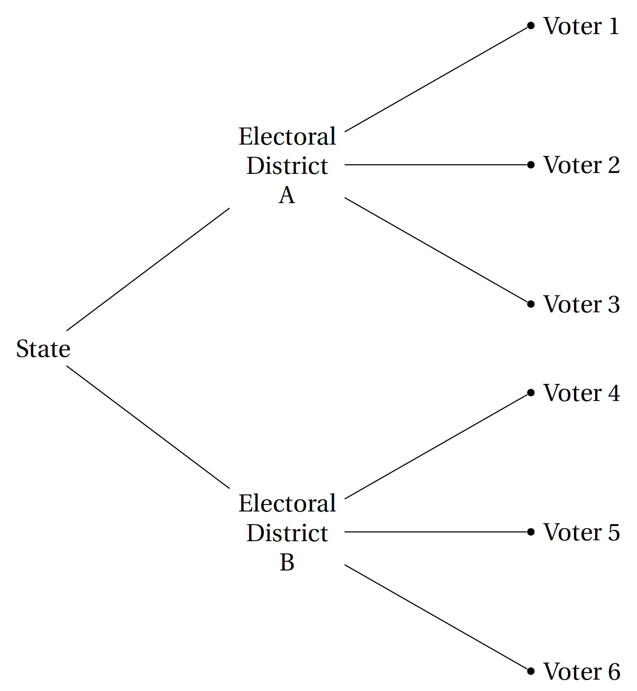
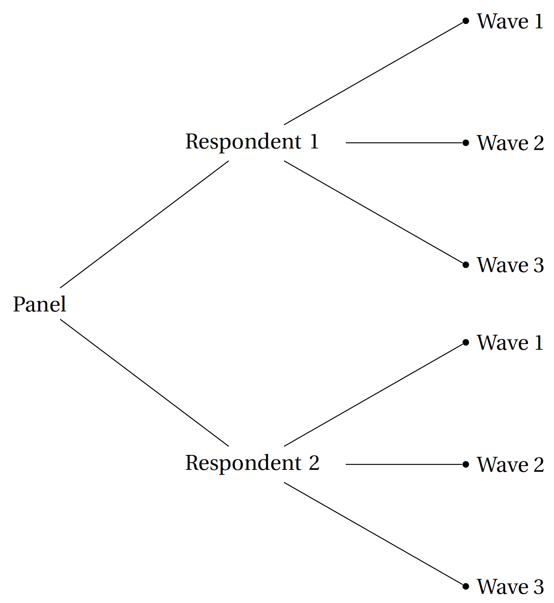
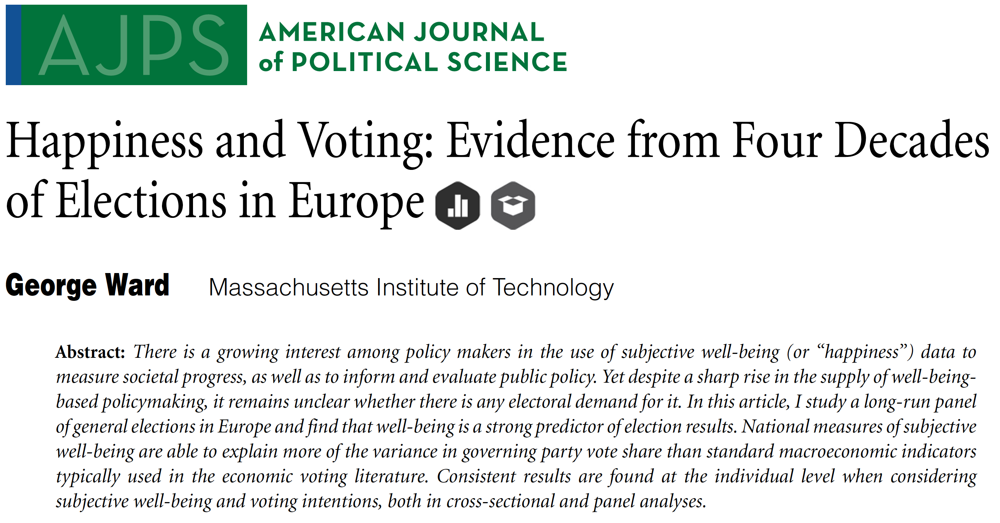
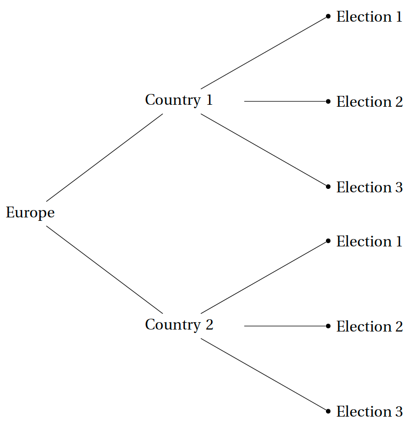

```{r setup}
# The first line sets an option for the final document that can be produced from
# the .Rmd file. Don't worry about it.
knitr::opts_chunk$set(echo = TRUE)

# First you define which packages you need for your analysis and assign it to 
# the p_needed object. 
p_needed <-
  c("viridis", "knitr", "MASS", "pROC", "nnet", "mlogit", "plm")

# Now you check which packages are already installed on your computer.
# The function installed.packages() returns a vector with all the installed 
# packages.
packages <- rownames(installed.packages())
# Then you check which of the packages you need are not installed on your 
# computer yet. Essentially you compare the vector p_needed with the vector
# packages. The result of this comparison is assigned to p_to_install.
p_to_install <- p_needed[!(p_needed %in% packages)]
# If at least one element is in p_to_install you then install those missing
# packages.
if (length(p_to_install) > 0) {
  install.packages(p_to_install)
}
# Now that all packages are installed on the computer, you can load them for
# this project. Additionally the expression returns whether the packages were
# successfully loaded.
sapply(p_needed, require, character.only = TRUE)

load("raw-data/nested_ex1.Rdata")
load("raw-data/nested_ex2.Rdata")
load("raw-data/fe_ex.Rdata")
```

---

## Before we get started

Today we are going to learn about the analysis of *nested*, *hierachical* or *multi-level data*. There is good and bad news:

The bad news is:

  + This is a huge new field.
  + The literature is not easy to get into since different subfields and authors use different terms for the same things or the same terms for different things.

The good news is: 

  + We devote two entire sessions on the topics (even though Thomas will only spend one week on Multi-level models in the lecture).
  + After those two sessions, you will possess the necessary vocabulary to dive deep into the literature if you are interested.
  + From a purely technical perspective, by now, you already have everything to dive into this literature. We just need to learn the language.

**Learning Goal for this and next week:**

The goal for the next two session is to become familiar with the basic concepts in this literature. After the two sessions, you will be able to understand the following concepts and terms and understand how they are related to one another:

  + Nested Data
  + Hierachical Data
  + Time-Series Cross-Sectional Data
  + Panel Data
  + Fixed Effects
    + Unit Fixed Effects and Time Fixed Effects
    + One-way and two-way fixed effects regression
  + Random Effects
  + Mixed Effects
  + Multi-Level Regression
  + Pooling, no pooling, and partial pooling

Ultimately, you will learn how to make an informed choice about which model to use when you work with some sort of nested data.

We will split the two session in the following way: 

  + Today: 
    + **Fixed Effects** Regression Models
  + Next Week: 
    + **Random Effects** and **Multi-Level Regression**
    + Multi-Level Regression, random effects, fixed effects: How to choose?

---

## Program for today

In this session, we will learn about:

  1. A lot of vocabulary
  2. Fixed Effects Regression
  3. Simulating QoI based on Fixed Effects Regression
  

---

## What is "nested" or "hierarchical" data?

The terms "nested data structures", "hierarchical data structures", or "multilevel data structures" all describe the same thing: There are units of analysis in the data that are a subset of other units. You will soon notice that we encounter such structures all the time. For example, voters are nested in electoral districts (nested in states, nested in countries, ...)



In a data frame, this could look like this:

```{r, echo=F}
nested_ex1
```

### Panel Data and Time-Series Cross-Section Data (TSCS)

When you read about fixed and random effects, this will be very often (but not always) be in the context of panel data and time-series cross-section (TSCS) data. Both of these terms refer to data structures where we observe the same units of analysis multiple times. 

  + **Panel Data**: large $N$, relatively short $T$.
  + **TSCS**: smaller $N$, large $T$.
  
This sort of data is quite common and very useful! We encounter it in the context of nested data because it yields the same data structure: waves (or time points of observation) are nested in individual observations. In a panel survey study, this could look like the following:



In a data frame, this could look like this:

```{r, echo=F}
nested_ex2
```

## "Fixed Effects" Regression

There are many possibilities to analyse nested data. Today, we will talk about so called "fixed effects" regression models. This may sound fancier and newer to you than it actually is. You will see why very soon, but let's first introduce the data for today.

### Data for today: Happiness and Voting

We will replicate (although not exactly) some of the results from an article by George Ward that appeared in the *American Journal of Political Science* in 2020.



Ward is interested in a quite straightforward question: *Is happiness a predictor of election results?*, or more specifically: *Do government parties get more votes when the electorate is happy?* Ward uses observational data to find an answer to this question. He did both micro and macro level analyses. We will focus on the macro level analysis.

```{r}
load("raw-data/ward_macro.Rdata")

head(dta)
```

We have the following variables:
  
  + `country` = country
  + `year` = election year
  + `vote_share_cab` = % votes won by cabinet parties
  + `vote_share_cab_tmin1` = % votes at previous election by cabinet parties
  + `satislfe_survey_mean` = Life Satisfaction, Country-Survey mean (1-4 scale)
  + `parties_ingov` = Number of parties in government
  + `seatshare_cabinet` = % seats held by governing coalition
  + `cab_ideol_sd` = Gov Ideologial Disparity (Standard deviation of government party positions on left-right scale)
  + `ENEP_tmin1` = Party Fractionalisation - Last Election (Gallagher Fractionalization Index)

This is time-series cross-section data: We observe multiple elections in different (European) countries, i.e. elections are nested in countries.



Let's stop for a moment an think about why this straightforward question may be difficult to answer based on the available data. Let's say that you find a correlation between citizen's happiness (`satislfe_survey_mean`) before an election and the electoral outcome (e.g. `vote_share_cab`). Would you consider this as strong evidence for the claim that happiness *causes* voters to vote for incumbent parties?

Quite obviously, there may be ommitted confounding variables. Because the data structure is hierarchical, we can think of potential counfounders on the *country level (variables that vary between countries but not are constant over time)* and on the *election level (variables that vary within countries)*.

Can you think of potential confounders on the country level (not time-varying)?

  + ?
  + ?
  + ?
  
What about potential confounders on the election level?
  
  + ?
  + ?
  + ?
  

For the moment, let's recognize: This is a challenging research question. But: Although we did not work with time-series data yet, we already have the skills to tackle many of the challenges. We will apply those skills step-by-step and eventually arrive at the model that Ward used in the article.

### Step 1: Pooled linear regression

Our dependent variables is `vote_share_cab` (vote share of cabinet parties) and we are interested in the effect of happiness (`satislfe_survey_mean`). Note that in the original paper, Ward uses the z-standardised variable for this, so the results will be different. There is also a series of control variables, but let's ignore this for the moment, we will include them later. Let's start very simple:

```{r}
lm_pooling <- lm(vote_share_cab ~ satislfe_survey_mean,
                 data = dta)

summary(lm_pooling)
```

The model can be written as follows:

$$
y_{it} = \beta_0 + \beta_1x_{it} + \epsilon_{it}
$$
Subscripts:

  + $i$ indicates countries.
  + $t$ indicates time points, i.e. elections.

Thus:

  + $y_{it}$ is the vote share of cabinet parties in country $i$ at election $t$.
  + $x_{it}$ is the life satisfaction in country $i$ at election $t$.
  + $\epsilon_{it}$ is the unobserved error in country $i$ at election $t$.

This approach is sometimes called **complete pooling**, because we throw all the data from all the countries and all the elections into one and the same pool. Or in other words: we ignore the nested data structure at hand.

Thus, with the pooled regression model **we do not solve the issue of potential omitted confounders, neither on the country level (time-invariant), nor on the election level (time-varying)**. The resulting estimates will very likely suffer from omitted variable bias.

Also, some model assumptions will be difficult to justify. Think of independence: Are individual observations really independent from one another? In this case, we'd like to ask ourselves whether, for example, the cabinet vote share in Italy 1979 is really independent of the cabinet vote share in Italy 1983.

_Side-question_: If "complete pooling" means to throw all data into one pool and fit the regression model, what could "no pooling" mean?

### Step 2: Fixed Effects Model

We now turn towards fixed effects regression models. There are different sorts of fixed effects, broadly speaking unit and time fixed effects. Let's start with unit fixed effects

#### Step 2.1: Unit Fixed Effects

Unit fixed effects regression models can be very useful for time-series data because they help us to solve one of the problems we already identified: omitted confounders on some higher level unit of observation. This higher level unit, in our case, are countries. That's why we could also label the model **country fixed effects model**. How does this work? 

There are different ways to estimate a fixed effects regression model. One way is as simple as the following:

```{r}
fe_1 <- lm(vote_share_cab ~ satislfe_survey_mean +
             as.factor(country),
           data = dta)

summary(fe_1)

```

All that we do is to include $N - 1$ country dummies in the regression equation. Although quite simple, this is very powerful: 

**By including country fixed effects, we implicitly account for all (unobserved) time-invariant country level confounding variables.** 

Or more generally:

By including unit fixed effects, we implicitly account for (unobserved) time-invariant unit level confounding variables.

Thus, once we include unit fixed effects in our model, we do not have to worry about potential time-invariant confounders on the country level anymore. In fact, we cannot include them anymore--even if we wanted to.

Why is that? Because when we allow one intercept for each country, we get $N$ regression lines, one for each country (but each with the same slope). We can look at this graphically:

```{r echo = F}

par(mfrow = c(1, 2))

plot(x = fe_ex$x,
     y = fe_ex$y,
     pch = 19,
     bty = "n",
     xlab = "x",
     ylab = "y",
     main = "Pooled Regression",
     font.main = 1)
abline(lm(y ~ x, data = fe_ex),
       lwd = 2)

plot(x = fe_ex$x,
     y = fe_ex$y,
     pch = 19,
     bty = "n",
     xlab = "x",
     ylab = "y",
     main = "Fixed Effects Regression",
     font.main = 1,
     col = viridis(4)[fe_ex$unit])

fe_coefs <- coef(lm(y ~ x + as.factor(unit), data = fe_ex))
abline(fe_coefs[1], fe_coefs[2],
       lwd = 2,
       col = viridis(4)[1])
abline(fe_coefs[1] + fe_coefs[3], fe_coefs[2],
       lwd = 2,
       col = viridis(4)[2])
abline(fe_coefs[1] + fe_coefs[4], fe_coefs[2],
       lwd = 2,
       col = viridis(4)[3])
abline(fe_coefs[1] + fe_coefs[5], fe_coefs[2],
       lwd = 2,
       col = viridis(4)[4])
```

To estimate the model, we **only use the variation of x and y _within_ countries**. All variation _between_ countries is eliminated. This has advantages and disadvantages:

  + **Advantage**: Confounders that only vary between countries are of no more concern.
  + **Disadvantage**: We lose all the higher level information. So if we were interested in why governing parties in country A seem to systematically receive more votes than governing parties in B, then we cannot answer them anymore as soon as we include country fixed effects.

### Different ways to estimate the Fixed Effects Regression

There are many ways to estimate fixed effects. As we just saw, the first option was to include a series of dummy variables. The model from above can be written as the following:

$$
y_{it} = \beta_0 + \beta_1x_{it} + \xi_{i} + \epsilon_{it}
$$

where $\xi_{i}$ denotes the country fixed effects (i.e. the country dummies). 

Another way to estimate this model is to extract the within variance prior to model estimation by "de-meaning" the variables:

$$
(y_{it} - \bar{y}_{it}) = \beta_0 + \beta_1 (x_{it} - \bar{x}_{it}) + (\epsilon_{it} - \bar{\epsilon}_{i})
$$

This provides us with the exact same estimate of $\beta_1$:

```{r}
# calcualte de-meaned IV:
means_satis <- 
  aggregate(dta$satislfe_survey_mean,
            by = list(dta$country),
            FUN = mean)
names(means_satis) <- c("country", "mean")

dta$mean_satis <- 
  means_satis$mean[match(dta$country, means_satis$country)]

dta$demeaned_satis <- dta$satislfe_survey_mean - dta$mean_satis

# calcualte de-meaned DV:
means_vote <- aggregate(dta$vote_share_cab,
                   by = list(dta$country),
                   FUN = mean,
                   na.rm = T)
names(means_vote) <- c("country", "mean")

dta$mean_vote <- means_vote$mean[match(dta$country, means_vote$country)]

dta$demeaned_vote <- dta$vote_share_cab - dta$mean_vote

# estimate FE regression
fe_2 <- lm(demeaned_vote ~ demeaned_satis,
           data = dta)

# compare results
summary(fe_2)
summary(fe_1)
```

Note however, that the standard errors are off (because less degrees of freedom used). The advantage of this approach is that it is less computationally demanding as compared to the including dummies, especially when you work with panel survey data where you would have to include one dummy for each respondent of the panel. Luckily, the problem with the standard error can be fixed. We will use the `plm` package to do that for us:

```{r}
fe_plm <- plm(vote_share_cab ~ satislfe_survey_mean, 
              data = dta,
              index = c("country"), 
              model = "within")

summary(fe_plm)
summary(fe_1)
```


### Two-way fixed effects: Adding year fixed effects

Following the same logic, we now can also include "time fixed effects" (or in our case "year fixed effects"). Just as country fixed effects help us to account for all unobserved confounders that only vary across countries (but not within countries), *time fixed effects help us to account for all unobserved confounders that only vary across time (but not within time, i.e. between countries at one point in time)*. Let's use the dummy solution to that:

```{r}
tw_fe_1 <- lm(vote_share_cab ~ satislfe_survey_mean + 
                as.factor(dta$year) + as.factor(dta$country),
              data = dta)

summary(tw_fe_1)
```

This gives us the so-called *two-way fixed effects regression model* (as compared to one-way fixed effects). Although this is technically simple and widely used, it makes things more complicated on a conceptual level. If you are interested, I recommend you to read the [2020 Political Analysis paper by Imai and Kim](https://www.cambridge.org/core/journals/political-analysis/article/on-the-use-of-twoway-fixed-effects-regression-models-for-causal-inference-with-panel-data/F10006D0210407C5F9C7CAC1EEE3EF0D).


## Adding time-varying control variables

Let's stay with the country fixed effects model. By including country fixed effects, we made sure that our effect estimate is not biased due to unobserved confounders that are time-invariant on the country level. However, as we saw in the beginning, we still need to think about potential election level confounders (time-variant variables). Here, we are back in the familiar game: we must think about potential confounders, try to get the data and include them in our model. Ward includes a series of control variables:

```{r}
fe_final <- lm(vote_share_cab ~ satislfe_survey_mean + 
                parties_ingov + seatshare_cabinet + cab_ideol_sd + ENEP_tmin1 +
                as.factor(dta$country),
              data = dta)

summary(fe_final)
```

Let's summarise what we did:

  + We use TSCS data to estimate the effect of life satisfaction in a country on the performance of cabinet parties in elections.
  + We included country fixed effects to make sure that unobserved time-invariant country level confounders do not bias our effect estimate.
  + As this does not help with time-varying confounders, we additionally included a series of potential confounders that vary across countries *and* time (but concerns of omitted variable bias may still be there).

## Exercise: Simulating Quantities of Interest

To keep things simple, let's work model `fe_1` where we included only life satisfaction and country fixed effects.

```{r}
fe_1 <- lm(vote_share_cab ~ satislfe_survey_mean +
             as.factor(country),
           data = dta)

summary(fe_1)
```

At first glance, the effect size seems to be huge: One unit increase in average life satisfaction seems to lead to an 18 percentage points increase in cabinet vote share. But how plausible is a one unit increase in average life satisfaction?

In an important article, [Mummolo and Peterson (PSRM, 2018)](https://www.cambridge.org/core/journals/political-science-research-and-methods/article/improving-the-interpretation-of-fixed-effects-regression-results/4145615389057E25D4B46D44AC9CB89C) point out that we must be very careful in specifying plausible changes in the independent variable when using fixed effects regression. 

Let's say we want to learn about the change in cabinet vote share when there is a one standard deviation increase in average life satisfaction. Because by including country fixed effects we eliminated all between country variation of our variables, in order to calculate this standard deviation, we have to use the de-meaned variable of average live satisfaction. Otherwise it is possible that we calculate the first difference between two scenarios that would never plausibly occur *within* countries. 

Let's have a look at the distribution of `satislfe_survey_mean` as well as it's de-meaned version.

```{r}
par(mfrow = c(1, 2))

hist(dta$satislfe_survey_mean,
     main = "Histogram of life satisfaction",
     font.main = 1, 
     xlim = c(2, 4),
     border = NA, 
     xlab = "Life satisfaction")
hist(dta$demeaned_satis,
     main = "Histogram of life satisfaction,\n(de-meaned)",
     font.main = 1, 
     xlim = c(-1, 1),
     border = NA, 
     xlab = "Life satisfaction (de-meaned)")

sd(dta$satislfe_survey_mean)
sd(dta$demeaned_satis)
```

In the exercise section, I want you to simulate a first difference. Choose two scenarios: One that takes the *mean value of average life satisfaction* and one that is *one within-country standard deviation higher*. To learn about the point made by Mummolo and Peterson, do this also "the wrong way" and calculate the standard deviation of the original life satisfaction variable and repeat the procedure.

Maybe the simulation function from QM will help you here:

```{r}
sim_function <- function(lm_obj, nsim = 1000, scenario){
  
  # Step 1: Get the regression coefficients
  beta_hat <- coef(lm_obj)
  
  # Step 2: Generate sampling distribution
  
  # Step 2.1: Get the variance-covariance matrix.
  V_hat <-  vcov(lm_obj) 
  
  # Step 2.2: Draw from the multivariate normal distribution.
  S <- mvrnorm(nsim, beta_hat, V_hat)

  # Step 3: Choose interesting covariate values. 
  # Make sure the matrix multiplication also works for single scenarios
  if(is.null(nrow(scenario))){
    scenario <- matrix(scenario, nrow = 1)
  }
  
  # Print a message if the scenario does not fit the regression.
  if(ncol(scenario) != length(lm_obj$coefficients)){
    return(cat("The scenario has the wrong number of variables."))
  } 
  
  # Step 4: Calculate Quantities of Interest - 
  # Expected Values
  EV <- S %*% t(scenario)
  return(EV)
}
```

```{r}

```


## Concluding Remarks:

- Next week, we will talk about Random Effects and Multi-Level Models.

- Don't forget the (final!) homework assignment.

- Please participate in the course evaluation :)

